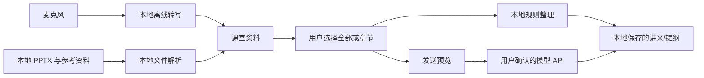

# 课堂复习 Agent 简化需求文档

## 1. 产品定义

**课堂复习 Agent** 是一个仅在本机运行的网页工具。它完成一件事：把课堂实时转写、主 PPTX 和用户导入的基础参考资料结合，生成可靠、可追溯的复习资料。

它不是通用文件助手，也不是知识库。每节课以一份 PPTX 作为章节主线，可附加少量 PDF、Word、Markdown 或代码参考资料。

## 2. 解决的问题

学生在课堂中容易遗漏老师口头强调、例子和答疑；PPT 又常常只有标题和要点。工具需要将两者合并，并明确区分：

1. PPT 已有的知识点。
2. 老师讲到但 PPT 没有的补充。
3. 用户选定范围内完整且层级清楚的提纲。

## 3. 范围

### 必须有

- 单用户、本机网页 GUI。
- 新建课堂、导入一份 `.pptx`、本地解析每页文字和标题。
- 可导入 PDF、DOCX、Markdown 和常见 UTF-8 代码文件，均在本机提取文字、章节或行号。
- 通过麦克风进行本地实时语音转文字，显示带时间戳的课堂转写。
- 用户可为转写添加“重点”标记，并可手动修正错误文字。
- 用户可选择“全部内容”或 PPT 章节，生成重点讲义、PPT 外补充或详细提纲。
- 可配置 DeepSeek、OpenAI 兼容和 Anthropic 兼容 API。
- 本地规则整理模式，在没有 API Key 或断网时可输出原始提纲。
- Markdown 与 HTML 导出。

### 第一版不做

- 多份 PPT 合并、扫描版 PDF 的 OCR、云同步、用户账号、协作、搜索互联网。
- 录制视频、摄像头功能、远程语音识别、自动翻译。
- 自动控制 Windows 全局“语音输入”。网页无法稳定、安全地接管该功能；应用改用自己的麦克风采集与本地离线转写。

## 4. 用户界面

页面是简洁的三栏布局：

| 区域 | 内容 |
| --- | --- |
| 左栏 | 当前课堂、主 PPT 章节树、参考资料列表、范围选择：`全部内容` 或章节多选 |
| 中栏 | PPT/参考资料预览、当前页码或代码行号、带时间戳的转写流、重点标记 |
| 右栏 | 生成模式、模型选择、发送预览、可编辑的 Markdown 结果 |

### 关键交互

1. **开始记录**：用户点击后才请求麦克风权限，顶部持续显示录音状态、时长、暂停和停止按钮。
2. **导入资料**：用户选择主 `.pptx` 后，应用在本地提取幻灯片标题、正文和页码，并按标题建立初始章节。用户可继续添加 PDF、DOCX、Markdown 或代码文件作为当前课堂的参考资料。
3. **选择范围**：用户可选择全部，也可多选章节；该范围同时控制本地整理与远程模型输入。
4. **生成**：先选择“重点讲义”“PPT 外补充”或“详细提纲”，再选择本地规则或模型服务。
5. **确认发送**：远程生成前显示发送预览。未确认时不能调用模型 API。

## 5. 核心流程



### 5.1 本地转写

- 使用浏览器麦克风权限收集音频，送给本机后端的 `faster-whisper` 或 `whisper.cpp`。
- 使用 VAD 按停顿切分，输出 `开始时间、结束时间、文本、识别状态`。
- 原始音频默认只保存在本机。用户可在设置中关闭音频留存，只保留转写。
- 浏览器的 `SpeechRecognition` 不可用作主路径，因为部分浏览器会使用云端服务。

### 5.2 参考资料解析与范围

PPTX 是章节和课堂转写关联的主线；附加资料只提供补充信息，不改变 PPT 原有章节顺序。

| 类型 | 扩展名 | 本地解析与来源定位 |
| --- | --- | --- |
| PDF | `.pdf` | 可选文字、页码；扫描页提示“未提取文字” |
| Word | `.docx` | 标题层级、段落和表格；标题路径 |
| Markdown | `.md`, `.markdown` | 标题层级和正文；标题路径 |
| 代码 | `.py`, `.js`, `.ts`, `.tsx`, `.jsx`, `.java`, `.go`, `.rs`, `.c`, `.cpp`, `.h`, `.cs`, `.sql`, `.json`, `.yaml`, `.yml`, `.toml`, `.sh` | UTF-8 文本、文件路径和行号 |

用户可在生成前选择是否包含每份参考资料；选择单一 PPT 章节时，默认只选该章节及用户明确勾选的参考资料片段。参考资料没有章节映射时，不会自动塞入单章生成。

### 5.3 PPT 与转写关联

第一版采用简单、可解释的规则：

1. 用户在课堂中切换 PPT 页时，点击或使用键盘标记当前页。
2. 每个标记记录页码与时间。
3. 标记间的转写片段归属到该页。
4. 用户没有标记时，片段保留为“未关联”，仍会进入全局提纲，避免遗漏。

不需要第一版实现自动语义对齐。

### 5.4 生成模式

| 模式 | 结果 |
| --- | --- |
| 重点讲义 | 按章节整理核心概念、结论、老师强调、例子、易错点和待核对项 |
| PPT 外补充 | 只写转写中出现、且选中 PPT 没有等价内容的有效补充、答疑和提醒 |
| 详细提纲 | 覆盖选中范围的分级提纲，重点优先保证不遗漏，不追求过度压缩 |
| 本地规则整理 | 不调用模型，按页码/章节列出 PPT 文本、选中的参考资料、关联转写、重点标记与未关联片段 |

所有生成结果必须保留来源，例如 `[PPT 第 6 页]`、`[PDF 第 4 页]`、`[讲义.docx：第 2 节]`、`[src/a.ts:20-34]` 或 `[课堂 08:13-08:34]`；听不清、内容冲突或无法判断时写 `待核对`。

## 6. 隐私与网络规则

### 6.1 数据存放

PPTX、参考资料、音频、转写、章节、生成结果和导出文件只保存在用户选择的本地数据目录。API Key 存入 Windows Credential Manager，不能写进源码、SQLite、日志、浏览器存储或导出文件。

### 6.2 允许的网络请求

1. 用户主动下载前端/后端依赖或离线语音模型。
2. 用户点击“确认发送”后，向其配置的大模型 API 发起一次生成请求。

远程模型请求只可包含本次选中的 PPT/参考资料提取文字、关联转写文字、资料位置和用户的生成指令。**不得上传原始文件、音频、未选章节、未勾选参考资料、其他课堂资料或历史讲义。**

### 6.3 发送预览

确认框至少显示：

- 模型服务商、端点和模型名。
- 用户选择的章节、PPT 页码及勾选的参考资料片段。
- 关联转写的时间范围和字符数。
- 即将发送的 PPT/参考资料/转写文本字符数、Token 估算和可估算费用。
- `取消`、`返回修改范围` 和 `确认发送`。

每次生成都必须重新确认。取消后零模型请求。

## 7. 简化技术方案

| 层 | 选择 | 说明 |
| --- | --- | --- |
| GUI | React + TypeScript + Vite | 在本机浏览器打开 |
| 本地后端 | FastAPI + Python 3.11 | 只监听 `127.0.0.1` |
| 数据 | SQLite + 课堂文件目录 | 适合单用户单机 |
| PPT/资料解析 | `python-pptx`、`pypdf`、`python-docx`、标准库文本读取 | 只提取本地文本与来源位置 |
| 转写 | `faster-whisper` + VAD | 本机离线运行 |
| 凭据 | `keyring` / Windows Credential Manager | Key 不进入普通文件 |
| 模型 | 后端 Provider Adapter | OpenAI 兼容和 Anthropic 兼容两种适配 |

后端接口保持最小化：

| 方法 | 路径 | 作用 |
| --- | --- | --- |
| `POST` | `/api/lessons` | 新建课堂 |
| `POST` | `/api/lessons/{id}/ppt` | 导入并解析主 PPTX |
| `POST` | `/api/lessons/{id}/sources` | 导入并解析 PDF、DOCX、Markdown 或代码文件 |
| `POST` | `/api/lessons/{id}/recording/start` | 开始录音和本地转写 |
| `POST` | `/api/lessons/{id}/audio` | 接收浏览器音频分块 |
| `POST` | `/api/lessons/{id}/recording/stop` | 停止录音 |
| `GET` | `/api/lessons/{id}` | 返回课堂、PPT、参考资料和转写 |
| `POST` | `/api/generate/preview` | 计算范围和发送预览，不联网 |
| `POST` | `/api/generate` | 本地整理或确认后调用模型 |

`/api/generate` 必须校验由预览接口创建的一次性确认令牌，令牌过期或范围改变后需要重新预览。

## 8. Agent 行为

Agent 只负责整理，不替用户补充未知知识。远程模型提示词固定包含：

```text
你是课堂复习整理 Agent。只使用本次提供的 PPT 页文本、选中的参考资料文本、课堂转写和用户指令。
不得编造资料中没有的事实、定义、公式、例子或结论。
保留给定 PPT 章节顺序。每个重要条目注明 PPT 页码、参考资料位置或课堂时间范围。
将 PPT 既有内容与“课堂补充（PPT 外）”分开。
转写不清、材料冲突或无法确认时标记“待核对”。
详细提纲优先覆盖全部关键事实，删除口头重复和明显识别噪声即可。
只输出 Markdown 结果，不输出推理过程。
```

用户的补充指令只能影响输出形式，不能覆盖来源、范围和不编造规则。

## 9. MVP 验收

- [ ] 本机浏览器页面可以创建课堂、导入 `.pptx`、PDF、DOCX、Markdown 和代码文件，并显示页码、标题或行号。
- [ ] 用户主动点击后才能开始录音；断网时可完成本地录音和转写。
- [ ] 转写片段可编辑、标重点、关联页码，未关联内容不会被静默删除。
- [ ] 可选择全部或章节，得到重点讲义、PPT 外补充、详细提纲和本地规则提纲。
- [ ] 没有点击确认前，网络审计中不存在模型请求。
- [ ] 确认后，模型请求只含选中范围的提取文本，原始文件和音频不出本机。
- [ ] DeepSeek/OpenAI 兼容及 Anthropic 兼容配置可以工作，API Key 不泄漏到本地普通文件。
- [ ] 结果可编辑并导出 Markdown/HTML。
